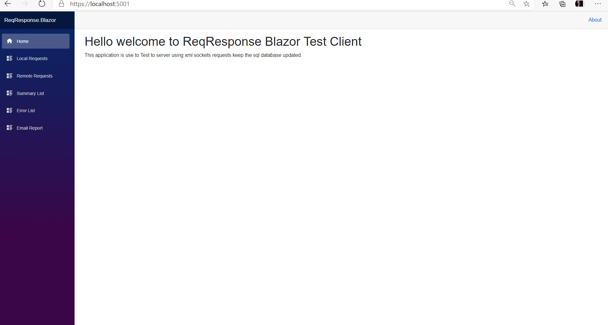
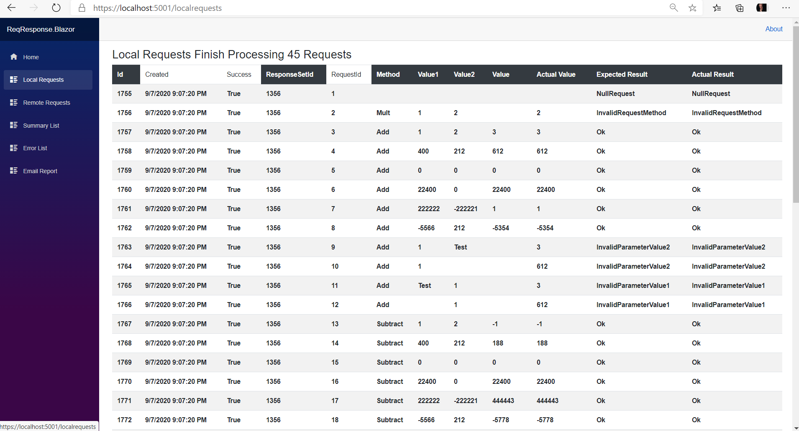
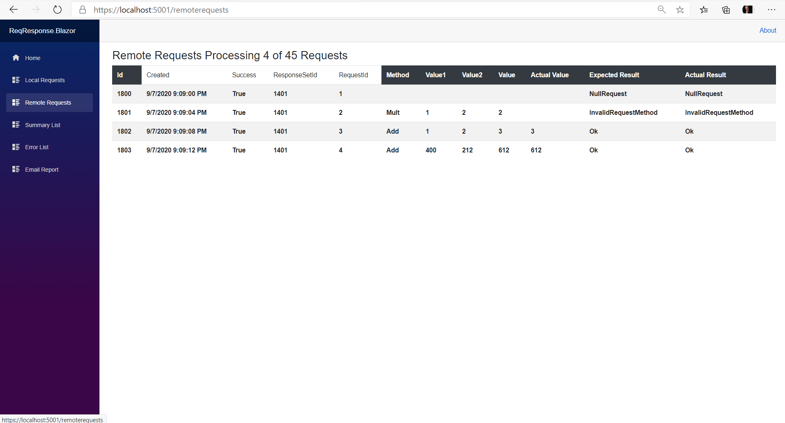
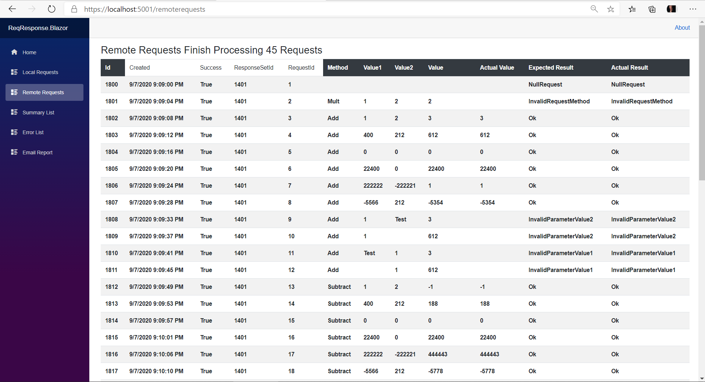
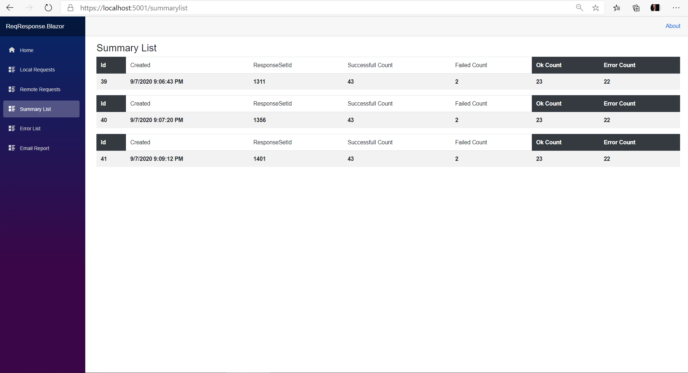
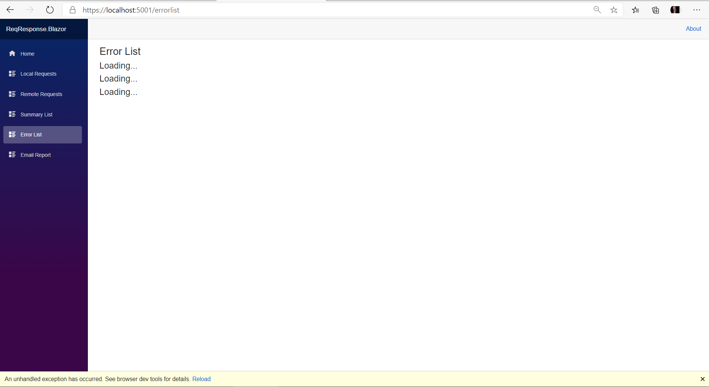
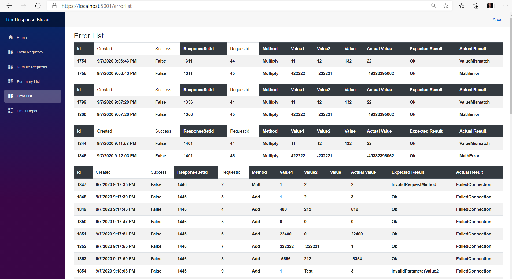
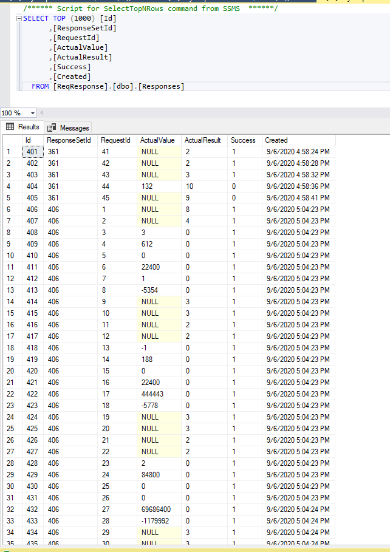
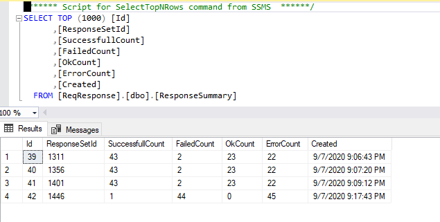

 By Stewart Hyde
================

**Introduction**
================

I design this GitHub project for demonstrating the ability to create a testing
environment designed to test XML based service to a simulated device which could
be replaced with a hardware device communicating via sockets.

I have found in my struggle during the last six months that I must improve my
knowledge of new technique because my previous job was behind the time in
technology. But the internet can improve one’s knowledge and using experience
from the past and knowledge of systems, we can create a reliable platform. We
could use the end design on the hardware device and we can use the included unit
test during build cycle but depending on additional hardware requirements. We
could test the unit test code with the hardware or a simulated base on xml
requirements.

The Blazor application can be tested with QA department and reports will be
stored in SQL database and if any issue comes up, it can be later determine
because of testing or because of an actual change in code on the device that is
connected via the socket connection. Any issues can be setup to email so that
notification will be made.

**Basic application design**
============================

This is project is completely in .Net Core 3.1 and uses the latest Blazor
technology to show results to use and email any errors to a specific user. The
logic for the simulated device is basic XML request and response system. With 4
primary operations which are Add, Subtract, Multiple and Divide.

First part was to create ReqResponse.dll which contains the 4 methods, common
xml models and service to process the methods. There are basically two methods a
local method and connected network method. The communications to server are done
with a latest techniques from Microsoft which can be found with the following
link for server.

<https://docs.microsoft.com/en-us/dotnet/api/system.net.sockets.tcplistener?redirectedfrom=MSDN&view=netframework-4.7.2>

And for the client

<https://docs.microsoft.com/en-us/dotnet/api/system.net.sockets.tcpclient?view=netframework-4.7.2>

ReqResponse. Service.exe is a simple command line server, which calls a routine
in ReqResponse.dll

When this server code is executed with logging turn on, the following is output

ReqResponse.Test is a MSTest project that can be used with Test Explorer and can
be also be used with connected ReqResponse.Server.Exe

The following is example screen used by Test Explorer.

There is also a small include TestApp.exe console application, I found this was
a simple way to test method during development. But is not required.

**Blazor Web Test application**
===============================

This is a visual way to display the results of test is a web application that
can results can be stored in SQL database and saved for later analysis. Current
support for different socket connections is not currently included and must be
enhanced if desired to support multiple devices.

For this example, local execution of methods is possible without the server. I
did this first, and local requests are significantly faster than remote
connections to a server.

Remote connections to server need special attention, I specifically the designed
to methods not to use async connections to simulate communication with device.
Because of deigned of Blazor screen, I figured out a method to stage requests 4
at time executing communicating to server.

Once the client is finished with executing all request, the message shows that
it has finish processing.

Once it has finished the request, it saves the results in SQL database using
Dapper Stored Procedures.

Contents are also stored in memory using in-memory database service using
dependency injection.

To help isolated issues, a summary is used to display results with the following
information

ResponseSetId: Unique Id for all requests for this test

Successful count: This is the count of successful tests

Failed Count: This is a count of failed tests and there are 2 test that always
failed

Ok Count: This is a count of tests that work logically base on input and output

Error Count: This is a count of tests that have a logical error base on input
and output

The difference between Failed and Error is that ErrorCount are a programmatic
test for a specific error like divide by zero for divide operation or math
overruns.

To help isolated problems with issues, I have a screen that displays the request
that failed with error not based on logic tests. Note that empty XML is
specifically check and not passed to the server. A simple reload of screen
corrects the problem. I believe there is some issue related to Blazor network
connections and TcpClient connections that are causing the issue. It requires
future research.

Once the screen is refresh, it provides the error list on the screen showing the
records which have errors. Here, there are two specific errors.

1.  Multiple test where included a test of expected value is not correct

2.  Multiple test it marked where expected result should MathError but as Ok.

There is also screen that allows emailing of request to email address in Json.
Future enhancement will store the current and time in the database.

Note if the ReqResponse.Server.exe is not loaded and response comes back as the
FailedConnection and success is reported as false. This a not a problem on
server, but that connection is not connected during test. On a device it could
mean that it has some network issues that will need to be a look at.

The system can report this issues on screen as below.

**Blazor Web Simulated default Requests**
=========================================

Inside the ReqResponse.Blazor.exe there is logic to load the simulated data into
memory and it stores data into SQL database. The following is a screenshot from
class

ReqResponse.Blazor.Data.Sim. RequestSimDataService

**Blazor Web SQL Sample Data**
==============================

Requests are store into SQL tabled and will later be loaded from this Table. If
the table is empty, this table will contained the data loaded from simulated
routine CreateDefaultTestRequests

When a test is performed using the Blaser application, it stores the results in
the following table. The actual requests is referenced by RequestId.

There is also a table that is used to calculate a summary for ResponseSetId,
which is all rows in the Requests table.

**Blazor example Email**
========================

The Blazor application as ability to email the specific user. It uses email
configuration in the Json file.

**Blazor Json for Connect string and Email**
============================================

Note Json files must be a change for your specific configuration.

