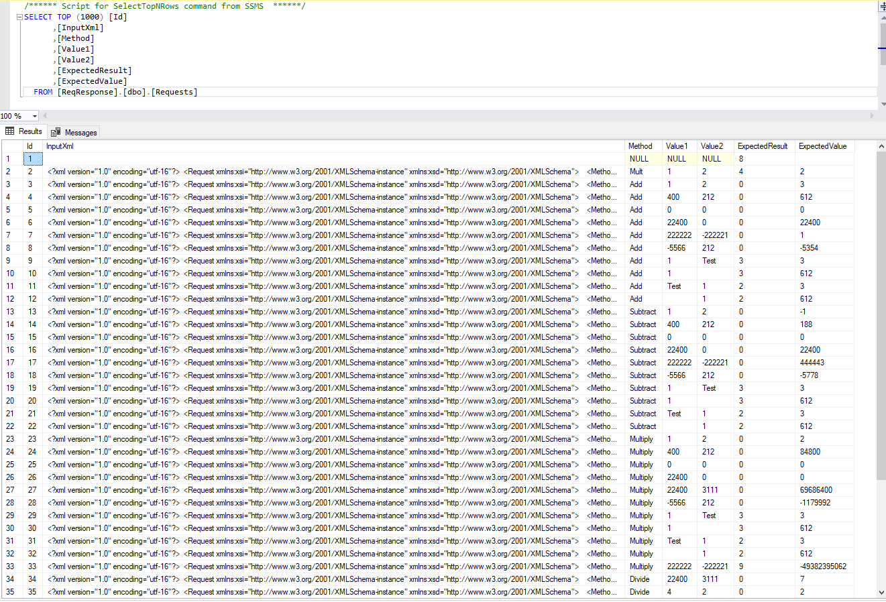

By Stewart Hyde
===============

Introduction
============

I design this GitHub project for demonstrating the ability to create a testing
environment designed to test XML based service to a simulated device which could
be replaced with a hardware device communicating via sockets.

I have found in my struggle during the last six months that I must improve my
knowledge of new technique because my previous job was behind the time in
technology. But the internet can improve one’s knowledge and using experience
from the past and knowledge of systems, we can create a reliable platform. We
could use the end design on the hardware device and we can use the included unit
test during build cycle but depending on additional hardware requirements. We
could test the unit test code with the hardware or a simulated base on xml
requirements.

The Blazor application can be tested with QA department and reports will be
stored in SQL database and if any issue comes up, it can be later determine
because of testing or because of an actual change in code on the device that is
connected via the socket connection. Any issues can be setup to email so that
notification will be made.

Basic application design
========================

This is project is completely in .Net Core 3.1 but upgraded to .Net 5 and uses
the latest Blazor technology to show results to use and email any errors to a
specific user. The logic for the simulated device is basic XML request and
response system. With 4 primary operations which are Add, Subtract, Multiple and
Divide.

First part was to create ReqResponse.dll which contains the 4 methods, common
xml models and service to process the methods. There are basically two methods:
a local method and connected network method. The communications to the server
are done with a latest technique from Microsoft, which can be found with the
following link for server.

<https://docs.microsoft.com/en-us/dotnet/api/system.net.sockets.tcplistener?redirectedfrom=MSDN&view=netframework-4.7.2>

And for the client

<https://docs.microsoft.com/en-us/dotnet/api/system.net.sockets.tcpclient?view=netframework-4.7.2>

ReqResponse. Service.exe is a simple command line server, which calls a routine
in ReqResponse.dll

With server code logging turn on, the following is output

Connected ReqResponse.Test is a MSTest project is possible with Test Explorer.
The of Test project Connected is not available and Remote is off by default and
turn on by Options.cs.

The following is example screen used by Test Explorer.

There is also a small include TestApp.exe console application, I found this was
a simple way to test method during development.

Blazor Web Test application
===========================

This is a visual way to display the results of test is a web application that
can results can be stored in SQL database and saved for later analysis. Current
support for different socket connections is not currently available. There are 3
ways to test services.

1.  Local: where is is local request call.

2.  Remote: This remote service call by default to localhost and port 11000 and
    by default does 4 requests. The connection is closed on every call, but
    slower.

3.  Connected: This is similar Remote except that connection and stream are kept
    open and does 10 requests. If disconnected, it will change behavior to 4 max
    requests.

Requests are limited so that user interface to refresh.

For this example, local execution of methods is possible without the server. I
did this first, and local requests are significantly faster than remote
connections to a server.

Remote connections to server need special attention, I specifically the designed
to methods not to use async connections to simulate communication with device.
Because of deigned of Blazor screen, I figured out a method to stage requests 4
at time executing communicating to the server.

When the client is done with executing all requests, the message shows it has
finish processing.

Once it has finished the request, it saves the results in SQL database using
Dapper Stored Procedures.

Memory resident class for in-memory database service using dependency injection.

Connected: This is an optimized version of Remote Request, where TcpClient and
NetworkStream is kept open for the request.

This reduces connection time.

To help isolated issues, a summary is used to display results with the following
information

Request Option: There are 3 type of Requests: Local, Remote or Connected

Time Executed: This time executed from client side.

ResponseSetId: Unique Id for all requests for this test

Successful count: This is the count of successful tests

Failed Count: This is a count of failed tests and there are 2 test that always
failed

Ok Count: This is a count of tests that work logically base on input and output

Error Count: This is a count of tests that have a logical error base on input
and output

The difference between Failed and Error is that ErrorCount are a programmatic
test for a specific error, like divide by zero for divide operation or math
overruns.

Once the screen is refreshed, it provides the error list on the screen showing
the records which have errors. Here, there are two specific errors.

1.  Multiple test where included a test of expected value is not correct

2.  Multiple test it marked where expected result should MathError but as Ok.

There is also screen that allows emailing of request to email address in Json.
Future enhancement will store the current and time in the database.

Note if the ReqResponse.Server.exe is not loaded and response comes back as the
FailedConnection and success is reported as false. This a not a problem on
server, but that connection is not connected during the test. On the device, it
could mean that it has some network issues that will need to be a look at.

With connected calls, it will switch to remote mode and only checks every 4
requests instead 10.

If connection, resume it will return to normal after finish disconnected loop

The system can report only errors with the following screen as below.

Blazor Web Simulated default Requests
=====================================

The ReqResponse.DataLayer.dll there is logic to load the simulated data into
memory and it stores data into SQL database. The following is a screenshot from
class.

ReqResponse.DataLayer.Data.Sim. RequestSimDataService

Blazor Web SQL Sample Data
==========================

Requests are stored into SQL tabled and will later be loaded from this Table. If
the table is empty, this table will contain the data loaded from simulated
routine CreateDefaultTestRequests

When a test is performed using the Blaser application, it stores the results in
the following table. The actual requests is referenced by RequestId.

There is also a table that is used to calculate a summary for ResponseSetId,
which is all rows in the Requests table.

Blazor example Email
====================

The Blazor application as ability to email the specific user. It uses email
configuration in the Json file.

Blazor Json for Connect string and Email
========================================

Note Json files must be a change for your specific configuration.

Updates
=======

02/24/2021 Updated Project to Net 5.0 and some cleanup.

02/26/2021 Updated Project for performance considerations and separating data
and service layers from user interface.
